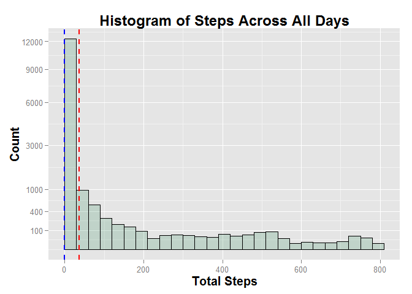
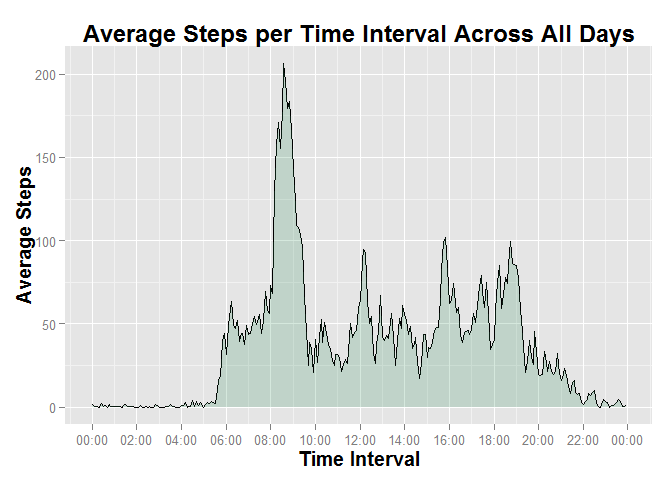
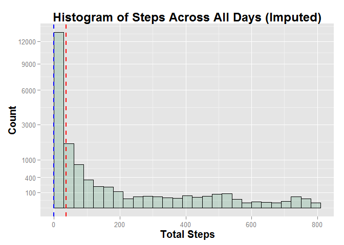
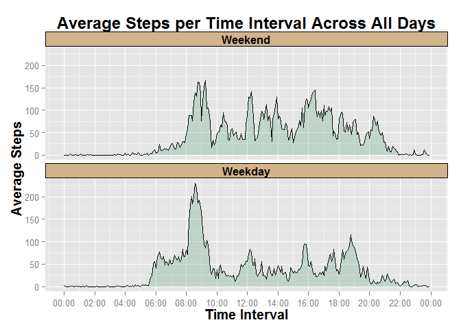

# Reproducible Research: Peer Assessment 1


## Loading and preprocessing the data

**STEP 0:**  Load all the required libraries.

```r
library("markdown")
library("knitr")
library("ggplot2")
library("reshape2")
library("plyr")
library("scales")
```


**STEP 1:**  Define the local file names.


```r
zipfile <- "./activity.zip"
datafile <- "./activity.csv"
```

**STEP 2:**  Check to see whether the .csv file exists, if not then extract the
.csv file from `activity.zip`.


```r
if (!file.exists(datafile)) {
    unzip(zipfile,
          overwrite=TRUE)
}
```

**STEP 3:**  Load the `activity.csv` file into the RStudio environment as the 
data frame *activity*. The file contains three data elements: *steps*, 
*date*, and *interval* that have the following classes
`colClasses=c("integer","character","integer")`.  The 
`na.strings="NA"` argument is set to indicate the **NA** value for the data.


```r
activity <- read.csv(datafile,
                     colClasses=c("integer","character","integer"),
                     na.strings="NA")
```

**STEP 4:** At this point it would be useful at this time to create a `POSIXlt` 
time interval value in the data frame. This requires some string manipulation
to convert *interval* from an integer value into a **hh:mm** character string.


```r
stime <- sprintf("%04d",activity$interval)
stime <- paste0(substr(stime,1,2),":",substr(stime,3,4))
activity$timeInterval <- as.POSIXlt(paste(activity$date,stime))
```

**STEP 5:** The resulting data frame has the following structure.


```r
str(activity)
```

```
## 'data.frame':	17568 obs. of  4 variables:
##  $ steps       : int  NA NA NA NA NA NA NA NA NA NA ...
##  $ date        : chr  "2012-10-01" "2012-10-01" "2012-10-01" "2012-10-01" ...
##  $ interval    : int  0 5 10 15 20 25 30 35 40 45 ...
##  $ timeInterval: POSIXlt, format: "2012-10-01 00:00:00" "2012-10-01 00:05:00" ...
```


## What is mean total number of steps taken per day?

To answer this question it is useful to generate a histogram of the total number
of steps taken per day across all the days. Since a great number of the *steps* 
values are **NA** the NA values must first be removed from the data prior to
generating the histogram.  This is accomplished by use of `na.omit(activity)` 
in `ggplot`.  The **mean** is displayed by a dashed red line and the
**median** by a dashed blue line.


```r
g <- ggplot(na.omit(activity), aes(x=steps)) + 
     geom_histogram(origin=0, binwidth=30, 
                    color="black", fill="seagreen", alpha=.2) + 
     scale_y_sqrt(breaks=c(100,400,1000,3000,6000,9000,12000)) +
     geom_vline(aes(xintercept=mean(steps)),
                color="red",
                linetype="dashed",
                size=1) +
     geom_vline(aes(xintercept=median(steps)),
                color="blue",
                linetype="dashed",
                size=1) +
     labs(title="Histogram of Steps Across All Days",
          x="Total Steps",
          y="Count") +
     theme(title=element_text(face="bold",size=rel(1.25)),
           strip.text=element_text(face="bold",size=rel(1.0)),
           legend.position="none")
print(g)
```

 

The **mean** and **median** total number of steps taken each day are as follows.


```r
mean(activity$steps,na.rm=TRUE)
```

```
## [1] 37.38
```

```r
median(activity$steps,na.rm=TRUE)
```

```
## [1] 0
```

```r
summary(activity$steps)
```

```
##    Min. 1st Qu.  Median    Mean 3rd Qu.    Max.    NA's 
##     0.0     0.0     0.0    37.4    12.0   806.0    2304
```

As can be seen from the histogram, the vast majority of *steps* values are near
zero which skews the histogram to the left.


## What is the average daily activity pattern?

The average daily activity pattern can be seen with a time series plot of the
5-minute intervals (x-axis) and the average number of steps averaged
across all days (y-axis).

Using a subset of the *activity* data frame, we first `melt` and then `dcast` 
the interval and average steps into a tidy dataset.  **NA** values are removed 
during the process.


```r
subA <- activity[,c(1,3)]
meltA <- melt(subA, id.vars=c("interval"), measure.vars=c("steps"), na.rm=TRUE)
tidyA <- dcast(meltA, interval ~ variable, mean)
```

Once again the interval needs to be converted to a POSIXlt time for plotting on 
the x-axis. The same approach that was taken previously will work with one
difference.  Since the date value is not displayed in the plot, any date can be 
used to create the POSIX date and time value.


```r
stime <- sprintf("%04d",tidyA$interval)
stime <- paste0(substr(stime,1,2),":",substr(stime,3,4))
tidyA$timeInterval <- as.POSIXlt(paste("2014-09-14",stime))
```

The time series graph for average daily activity is shown below.


```r
g <- ggplot(tidyA, aes(x=timeInterval,y=steps)) +
     geom_line() +
     geom_area(fill="seagreen",alpha=.2) +
     scale_x_datetime(breaks=date_breaks("2 hours"),
                      labels=date_format("%H:%M")) +
     labs(title="Average Steps per Time Interval Across All Days",
          x="Time Interval",
          y="Average Steps") +
     theme(title=element_text(face="bold",size=rel(1.25)),
           strip.text=element_text(face="bold",size=rel(1.0)),
           legend.position="none")
print(g)
```

 

The 5-minute interval containing, on average across all the days in the dataset,
the maximum number of steps is shown below.


```r
subset(tidyA, steps==max(tidyA$steps))
```

```
##     interval steps        timeInterval
## 104      835 206.2 2014-09-14 08:35:00
```


## Imputing missing values

As can be seen from the previous analysis, a significant number of **NA** and 
zero values are included in the data.  The zero values would simply indicate
the the individual was resting and not moving, but the **NA** values would
indicate that the unit was turned-off or had lost power such that no values
were recorded.  The presence of the missing data may introduce bias into the
calculations or summaries of the data.

One approach to dealing with missing values would be to assume the individual
performed similar tasks at similar time intervals throughout the day.  
Therefore, substituting the **NA** values for the average steps taken during
that time interval across all days would not be an unreasonable approach to
imputing the missing values.

One quick way to determine the extent of the missing data within the dataset
is to count up the total number of **NA** values across the entire dataset.


```r
colSums(is.na(activity))
```

```
##        steps         date     interval timeInterval 
##         2304            0            0            0
```

```r
length(activity$steps)
```

```
## [1] 17568
```

The **NA** values are limited to the *steps* data element and as can be seen, 
the total number of **NA** values is 2304 out of 
17568 rows (or more simply
13.1148% of the data).

The following R code will replace the **NA** values with the average steps for 
that time interval.  The first step is to pre-allocate a new vector for the
imputed values in order to preserve the original data values.


```r
activity$imputedSteps <- activity$steps
```

If the value is **NA** then replace it with mean for that 5-minute interval.


```r
for (i in 1:length(activity$imputedSteps)) {
    if (is.na(activity$imputedSteps[i])) {
        intervalMean <- tidyA$steps[tidyA$interval==activity$interval[i]]
        activity$imputedSteps[i] <- intervalMean
    }
}
```

Generating the new histogram with the **mean** displayed by a dashed red line
and the **median** by a dashed blue line we get the following graph.


```r
g <- ggplot(activity, aes(x=imputedSteps)) + 
     geom_histogram(origin=0, binwidth=30, 
                    color="black", fill="seagreen", alpha=.2) + 
     scale_y_sqrt(breaks=c(100,400,1000,3000,6000,9000,12000)) +
     geom_vline(aes(xintercept=mean(imputedSteps)),
                color="red",
                linetype="dashed",
                size=1) +
     geom_vline(aes(xintercept=median(imputedSteps)),
                color="blue",
                linetype="dashed",
                size=1) +
     labs(title="Histogram of Steps Across All Days (Imputed)",
          x="Total Steps",
          y="Count") +
     theme(title=element_text(face="bold",size=rel(1.25)),
           strip.text=element_text(face="bold",size=rel(1.0)),
           legend.position="none")
print(g)
```

 

Along with the new **mean** and **median** values.


```r
mean(activity$imputedSteps)
```

```
## [1] 37.38
```

```r
median(activity$imputedSteps)
```

```
## [1] 0
```

```r
summary(activity$imputedSteps)
```

```
##    Min. 1st Qu.  Median    Mean 3rd Qu.    Max. 
##     0.0     0.0     0.0    37.4    27.0   806.0
```

Based on the results, the **mean** and **median** remain the same with only an
increase in the **3rd Quantile** apparent in the summary.


## Are there differences in activity patterns between weekdays and weekends?

To answer this question a new factor variable is created in the dataset with 
two levels - *Weekday* and *Weekend* - to indicate whether a given date is a
weekday or weekend.  This can easily be accomplished with the following R code.


```r
activity$wday <- as.factor(activity$timeInterval$wday)
levels(activity$wday) <- c("Weekend",rep("Weekday",5),"Weekend")
```

We then once again take a subset of the activity dataset in order to `melt`
and `dcast` the data for the time series graph.


```r
subA <- activity[,c(3,5,6)]
meltA <- melt(subA, id.vars=c("wday","interval"), measure.vars=c("imputedSteps"), na.rm=TRUE)
tidyA <- dcast(meltA, wday + interval ~ variable, mean)
```

Once again the interval needs to be converted to a POSIXlt time for plotting on 
the x-axis. The same approach that was taken previously will work with one
difference.  Since the date value is not displayed in the plot, any date can be 
used to create the POSIX date and time value.


```r
stime <- sprintf("%04d",tidyA$interval)
stime <- paste0(substr(stime,1,2),":",substr(stime,3,4))
tidyA$timeInterval <- as.POSIXlt(paste("2014-09-14",stime))
```

The time series graph for average daily activity by weekday and weekend
is shown below.


```r
g <- ggplot(tidyA, aes(x=timeInterval,y=imputedSteps)) +
     geom_line() +
     geom_area(fill="seagreen",alpha=.2) +
     facet_wrap(~ wday,nrow=2) +
     scale_x_datetime(breaks=date_breaks("2 hours"),
                      labels=date_format("%H:%M")) +
     labs(title="Average Steps per Time Interval Across All Days",
          x="Time Interval",
          y="Average Steps") +
     theme(title=element_text(face="bold",size=rel(1.25)),
           strip.text=element_text(face="bold",size=rel(1.0)),
           strip.background=element_rect(fill="tan",color="black",
                                         size=0.5),
           legend.position="none")
print(g)
```

 

Based on the graphs, a few observations can be made about differences in 
activity patterns between weekdays and weekends.

1. Weekday activities start around 5:30 AM in the morning, while weekend
activities start around 8:00 AM.
1. Weekday activities decline around 8:00 PM in the evening, while weekend
activities decline around 10:00 PM.
1. The peak average steps occurs around 8:30 AM on both weekday and weekends,
but the peak activity on a weekday is significantly higher than the peak 
activity on a weekend.
1. Weekdays have an initial peak activity around 8:30 AM in the morning with
a steep decline by 10:00 AM with lesser peaks at 12:00 noon, 4:00 PM, and 7:00
PM reflecting the type of activity performed during a typical work week.
1. Weekends, while having a lower overall peak activity compared to weekdays,
have a more consistent activity throughout the day.

